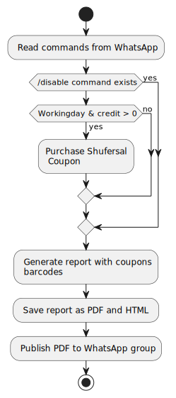

# 10bot

A bot to buy 10Bis coupons.
The project is a Python script that automates the purchase of Shufersal Coupons in a 10bis account if there is sufficient credit and only on working days. The script generates a report containing the list of coupons and their barcodes and saves it in both PDF and HTML formats. The PDF file is then published to a designated WhatsApp group. 
To ensure consistent operation, the script can be scheduled to execute daily, using CRON or cloud Bot, such as Azure Function.



## Installation and usage
### register to WhatApp API Provider
Register for a developer account in [GREEN API](https://green-api.com/).
Go through the ["Before you Start"](https://green-api.com/en/docs/before-start/) instructions.
Create instance, and authorized it.  
write down  ```idInstance```,  ```apiTokenInstance``` values, to be later use when installing.

## repository download
download the repository

```sh
git clone https://github.com/kfiry77/10bot
```

## install virtual environment and install requirements

```sh
cd 10bot
python -m venv .
source ./venv/bin/activate 
pip3 install -r requirements.txt
```
## Addtional machine installations 

Install prerequisites for weasyprint (for PDF report generation), as describe  [here](https://doc.courtbouillon.org/weasyprint/stable/first_steps.html)
### macOS
```sh
brew install weasyprint
```
### linux / Ubuntu 
```sh
apt install weasyprint
```
### Windows
 install [gtk3](https://github.com/tschoonj/GTK-for-Windows-Runtime-Environment-Installer/releases) runtime and it's dependencies, and add the runtime to PATH environment variable
```sh
PATH=%PATH%;C:\Program Files\GTK3-Runtime Win64\bin
```

Execute script ```main``` 

__note__: purchase won't be submitted if -d is specified. 
```sh
python3 main.py -d 
```

When prompt, enter email id used for 10Bis Account. you should be getting an SMS with OTP. type it
when prompt ```Enter OTP:```

```sh
 user@machine:~/10bot python3 main.py -d 
 Enter Email: yourmail@domain.com
 Enter OTP: 12345
```

Enter the Green API data, you have noted initially. 

```sh
*** Green API ***
Enter IntanceId : 1234567899 
Enter Api Token Instance : apiTokenInstance........
Enter ChatId/GroupId (Empty to create Group):
```

Hit enter to create a new chatgroup, enter the chatId(s) one by one (xxxxx@c.us), press enter when done.  
```sh
Enter ChatId/GroupId (Empty to create Group):
Enter ChatId(Empty When Done): 972501234567@c.us
Enter ChatId(Empty When Done): 972501234568@c.us
Enter ChatId(Empty When Done):
```

Wait for the script execution
```
User yourmail@domain.com Logged In
budget available= True
Dry Run success, purchase will be skipped.
scanning Month:2023-11-01
scanning Month:2023-10-01
Created report until 2023-10-01
```
Validate, that it finishes correctly. Once finishes, a New group named "10Bot" will be added on WhatAppApplication 
a  PDF with all the coupons will be shared in this group.

Add the script to the system crontab, by typing ```crontab -e ``` and adding the following line to it.   
```
0 23 * * *  (/bin/bash -c "cd /path/to/your/script && source .venv/bin/activate && python3 main.py  >> /path/to/your/log/10bot.log 2>&1 &") 
```

## Whatsapp Group Commands:
The application now wakes up every day at 23:00, To disable specific day purchase (due to vacation), send ```/disable``` commands 
to the group. ```/enable``` command will enable it again.
note that, only the command from last day is relevant, and of there is a conflict between command, the last one will 
be considered only. 
 
## references:

The code is bases from these repositories by [Dvir Perets](https://github.com/Dvirus89)
- [Dvirus89/tenbisbarcodes](https://github.com/Dvirus89/tenbisbarcodes)
- [Dvirus89/tenbis-buy-coupons](https://github.com/Dvirus89/tenbis-buy-coupons)

## TODO:  
- [x] Bug Fix: user-token header is not needed due to 10bis change of API, RefreshToken API should be used instead.  
- [x] Fix the holidays, to block only non-working day. 
- [ ] Add scrips the deployment to cloud providers:
  - [ ] Azure 
  - [ ] GCP
- [x] Add Report generation.
  - [x] Make the report formatter generic, for various kinds of files.
  - [x] Make PDF report formatter. 
- [x] Add report publisher, and make it generic using [chain of responsibility](https://en.wikipedia.org/wiki/Chain-of-responsibility_pattern)
       GOF design pattern. 
  - [x] whatsApp Publisher
  - [ ] Google Drive or Microsoft OneDrive Publisher. 
- and make it generic to various kind for example: Google Drive share.
- [x] Bug Fix : Pdf is cannot be generated on windows due to weasyprint dependency.
- [ ] describe software design with some plantuml class diagrams.
- [x] Coupon images crop, for a nicer report formatting.
- [x] Green API - send data to GroupChat 
- [x] Before purchasing, read from whatapps group message, if a message /disable exists, then purchase will be skipped 


